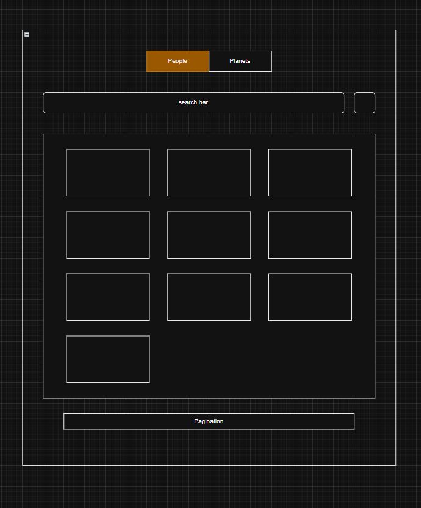

# Star Wars Mercedes Benz test 🌟

A modern web application built with Vue 3 that allows you to explore characters and planets from the Star Wars universe using the SWAPI API.

## 🚀 Features

- **Data Exploration**: View Star Wars characters and planets with detailed information
- **Real-time Search**: Filter by name with instant search functionality
- **Sorting**: Sort results alphabetically (A-Z / Z-A) and created
- **Pagination**: Efficiently navigate through large datasets
- **Responsive Design**: Adaptive interface that works on all devices
- **Toast Notifications**: User feedback system for actions and errors
- **Equal Height Cards**: Consistent visual presentation
- **Star Wars Theme**: Design inspired by the iconic franchise

## 🏗️ Project Architecture

### Domain-Driven Design (DDD)

I chose to implement **Domain-Driven Design** for the following reasons:

- **Clear Architecture**: DDD provides a well-defined structure that facilitates code maintenance and scalability
- **Professional Demand**: It's a highly valued architecture in modern job opportunities, especially in companies handling complex domains
- **Previous Experience**: I successfully used this architecture in my previous job, allowing me to implement it with confidence and best practices

```
src/
├── application/       # Application logic
│   ├── composables/   # Vue composables (useStoreManager, useToast)
│   └── stores/        # Global state with Pinia
├── domain/            # Domain entities
│   └── entities/      # Person.js, Planet.js
├── infrastructure/    # External services (APIs, HTTP)
├── presentation/      # UI components and views
│   ├── components/    # Reusable components
│   └── assets/        # Static resources
└── shared/            # Shared constants and utilities
```
### Vuetify 3 (Optional)
- **Convenience**: Ready-to-use Material Design components
- **Rapid Development**: Significantly accelerates development time
- **Consistency**: Ensures coherent and professional design
- **Responsiveness**: Built-in grid system and breakpoints
- **Accessibility**: Components that meet WCAG standards

### Axios vs Native Fetch (Optional)
I chose **Axios** over native fetch for:

- **Interceptors**: Centralized handling of requests/responses and errors
- **Automatic Transformation**: Built-in JSON parsing and automatic data modification
- **Better Error Handling**: More intuitive API for error management
- **Compatibility**: Native support for older browsers without polyfills
- **Global Configuration**: Base URLs, default headers, timeouts
- 
### Pinia for Global State (Optional)
- **Modern store** simple and clean for Vue 3
- **Native TypeScript support**
- **Excellent DevTools integration**
- **Modularity** for separate stores (people, planets)

### Testing Stack (Required by evaluation)
- **Vitest**: Fast test runner compatible with Vite
- **Playwright**: Robust and reliable E2E testing
- **Vue Testing Library**: Testing focused on user behavior

# Clone the repository

```bash
git clone https://github.com/iamcodex96/mercedes_starwars_test.git
cd mercedes_starwars_test
```

##  Installation and Usage

### Prerequisites
- Node.js 18+ 
- npm or yarn

### Installation

```bash
npm install

# or

yarn install

```
## Scripts available

```
using:

yarn ${script}

# or

npm run ${script}

```
### Available Scripts Summary

| Script | Description |
|--------|-------------|
| `dev` | Start development server with Vite |
| `build` | Build for production |
| `preview` | Preview production build locally |
| `lint:js` | Lint JavaScript and Vue files with ESLint |
| `lint:style` | Lint Vue and SCSS files with Stylelint |
| `lint` | Run both JS and style linting |
| `lint:fix` | Auto-fix linting issues for both JS and styles |
| `test` | Run unit tests in watch mode with Vitest |
| `test:ui` | Run unit tests with Vitest UI |
| `test:run` | Run unit tests once (CI mode) |
| `test:coverage` | Run tests with coverage report |
| `test:e2e` | Build and run E2E tests with Playwright |
| `test:e2e:dev` | Run E2E tests without building (dev mode) |

## Component Structure
### Main Components
- **`App.vue`**: Root component with main layout
- **`ItemListView.vue`**: Responsive grid of equal-height cards
- **`ItemCardDisplay.vue`**: Individual card for characters/planets
- **`ItemFilterComponent.vue`**: Search and sorting filters
- **`ToastComponent.vue`**: Notification system

### Composables
- **`useStoreManager.js`**: Centralized state and API management
- **`useToast.js`**: Global notification system

## UI/UX Features
- **Responsive Design**: Mobile-first approach
- **Equal Height Cards**: Flexbox for consistent layout
- **Loading States**: Spinners and skeleton loading
- **Error Handling**: Toast notifications for errors
- **Star Wars Theme**: Colors and typography inspired by the saga
- **Iconography**: Material Design Icons (@mdi/font)
- **Accessibility**: ARIA labels and keyboard navigation

Mocked wireframe of the initial idea



## CI/CD Pipeline
GitHub Actions configured with:
- **Automatic installation** of dependencies
- **Code and style linting**
- **Unit tests** with Vitest
- **E2E tests** with Playwright
- **Build verification** for production
- **Deployment** to github pages

### Development Guidelines
- Follow Vue 3 Composition API patterns
- Maintain DDD architecture principles
- Write tests for new features
- Update documentation for changes
- Follow existing code style


### Skills Demonstrated
- **Vue 3 Composition API**: Modern Vue development
- **Domain-Driven Design**: Clean architecture principles
- **State Management**: Pinia stores and composables
- **Testing**: Unit and E2E testing strategies
- **Performance**: Optimization techniques
- **CI/CD**: Automated pipelines
- **Responsive Design**: Mobile-first development


## License
This project is private and developed for technical evaluation purpos

*"May the Force be with you!" *